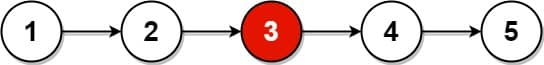
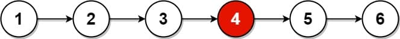

# 876. Middle of the Linked List

<p>Given the <code>head</code> of a singly linked list, return <em>the middle node of the linked list</em>.</p>

<p>If there are two middle nodes, return <strong>the second middle</strong> node.</p>

<p>&nbsp;</p>
<p><strong class="example">Example 1:</strong></p>

<pre><strong>Input:</strong> head = [1,2,3,4,5]
<strong>Output:</strong> [3,4,5]
<strong>Explanation:</strong> The middle node of the list is node 3.
</pre>

<p><strong class="example">Example 2:</strong></p>

<pre><strong>Input:</strong> head = [1,2,3,4,5,6]
<strong>Output:</strong> [4,5,6]
<strong>Explanation:</strong> Since the list has two middle nodes with values 3 and 4, we return the second one.
</pre>

<p>&nbsp;</p>
<p><strong>Constraints:</strong></p>

<ul>
  <li>The number of nodes in the list is in the range <code>[1, 100]</code>.</li>
  <li><code>1 &lt;= Node.val &lt;= 100</code></li>
</ul>

---

# Solution

- [Two Pointers Approach](#two-pointers-approach)

---


# Problem Overview: Middle of the Linked List

## Objective
Given the `head` of a singly linked list, return the **middle node**.  
If the list has an even number of nodes, return the **second** of the two middle nodes.

## Input
- A singly linked list with `n` nodes, where `1 ≤ n ≤ 100`
- Each node contains an integer value: `1 ≤ Node.val ≤ 100`

## Output
- A reference to the middle node of the list
- The returned node includes all subsequent nodes

## Examples

### Example 1
**Input:** `head = [1, 2, 3, 4, 5]`  
**Output:** `[3, 4, 5]`  
**Explanation:** The middle node is 3 (odd-length list)

### Example 2
**Input:** `head = [1, 2, 3, 4, 5, 6]`  
**Output:** `[4, 5, 6]`  
**Explanation:** Middle nodes are 3 and 4 → return the second (4)

## Constraints
- `1 ≤ n ≤ 100`
- `1 ≤ Node.val ≤ 100`

## Key Insight
Use a two-pointer approach:
- Initialize `slow` and `fast` pointers at the head
- Move `slow` one step and `fast` two steps at a time
- When `fast` reaches the end, `slow` will be at the middle

---

# Two Pointers Approach

## Intuition

To find the middle of a singly linked list efficiently, we use two pointers moving at different speeds:

- `slow` advances one node at a time.
- `fast` advances two nodes at a time.

Because `fast` moves twice as quickly, it reaches the end of the list in half the time. When `fast` is null (or its next is null), `slow` will be at the middle.  
This technique avoids counting nodes or using extra space, making it optimal for both time and space.

If the list has an even number of nodes, `slow` will naturally land on the second middle node, satisfying the problem's requirement.

## Algorithm

1. Initialize two pointers: `slow` and `fast`, both pointing to the head of the list.
2. Traverse the list:
   - Move `slow` one step forward.
   - Move `fast` two steps forward.
3. Continue until `fast` reaches the end (`null`) or its next is `null`.
4. Return the node pointed to by `slow`.

## Pseudocode

```
function middleNode(head):
    slow = head
    fast = head

    while fast ≠ null and fast.next ≠ null:
        slow = slow.next
        fast = fast.next.next

    return slow
```

## Implementation

### Java

```java
class Solution {
  public ListNode middleNode(ListNode head) {
    ListNode slow = head;
    ListNode fast = head;

    while (fast != null && fast.next != null) {
      slow = slow.next;
      fast = fast.next.next;
    }

    return slow;
  }
}
```
