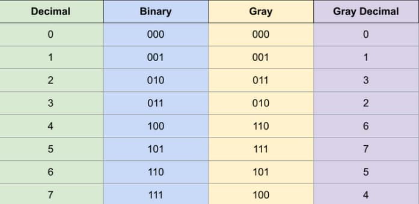

# 89. Gray Code

<p>An <strong>n-bit gray code sequence</strong> is a sequence of <code>2<sup>n</sup></code> integers where:</p>

<ul>
	<li>Every integer is in the <strong>inclusive</strong> range <code>[0, 2<sup>n</sup> - 1]</code>,</li>
	<li>The first integer is <code>0</code>,</li>
	<li>An integer appears <strong>no more than once</strong> in the sequence,</li>
	<li>The binary representation of every pair of <strong>adjacent</strong> integers differs by <strong>exactly one bit</strong>, and</li>
	<li>The binary representation of the <strong>first</strong> and <strong>last</strong> integers differs by <strong>exactly one bit</strong>.</li>
</ul>

<p>Given an integer <code>n</code>, return <em>any valid <strong>n-bit gray code sequence</strong></em>.</p>

<p>&nbsp;</p>
<p><strong class="example">Example 1:</strong></p>

<pre><strong>Input:</strong> n = 2
<strong>Output:</strong> [0,1,3,2]
<strong>Explanation:</strong>
The binary representation of [0,1,3,2] is [00,01,11,10].
- 0<u>0</u> and 0<u>1</u> differ by one bit
- <u>0</u>1 and <u>1</u>1 differ by one bit
- 1<u>1</u> and 1<u>0</u> differ by one bit
- <u>1</u>0 and <u>0</u>0 differ by one bit
[0,2,3,1] is also a valid gray code sequence, whose binary representation is [00,10,11,01].
- <u>0</u>0 and <u>1</u>0 differ by one bit
- 1<u>0</u> and 1<u>1</u> differ by one bit
- <u>1</u>1 and <u>0</u>1 differ by one bit
- 0<u>1</u> and 0<u>0</u> differ by one bit
</pre>

<p><strong class="example">Example 2:</strong></p>

<pre><strong>Input:</strong> n = 1
<strong>Output:</strong> [0,1]
</pre>

<p>&nbsp;</p>
<p><strong>Constraints:</strong></p>

<ul>
	<li><code>1 &lt;= n &lt;= 16</code></li>
</ul>

---

# Solution

- [Backtracking Approach](#backtracking-approach)

### **Problem Overview: Gray Code**  

#### **Definition**  
An **n-bit Gray Code sequence** is a sequence of \(2^n\) integers that satisfies the following conditions:  
- Every integer falls within the inclusive range \([0, 2^n - 1]\).  
- The first integer is **0**.  
- No integer appears more than **once** in the sequence.  
- The **binary representation** of every pair of adjacent integers differs by **exactly one bit**.  
- The **binary representation** of the first and last integers differs by **exactly one bit** (forming a cyclic sequence).  

#### **Task**  
Given an integer **n**, return any valid **n-bit Gray Code sequence**.

---

### **Examples**  

#### **Example 1**  
**Input:**  
```plaintext
n = 2
```  
**Valid Outputs:**  
```plaintext
[0,1,3,2]
```
or  
```plaintext
[0,2,3,1]
```  

**Binary Representation of [0,1,3,2]:**  
- **00** → **01** (1 bit change)  
- **01** → **11** (1 bit change)  
- **11** → **10** (1 bit change)  
- **10** → **00** (1 bit change)  

**Binary Representation of [0,2,3,1]:**  
- **00** → **10** (1 bit change)  
- **10** → **11** (1 bit change)  
- **11** → **01** (1 bit change)  
- **01** → **00** (1 bit change)  

#### **Example 2**  
**Input:**  
```plaintext
n = 1
```  
**Output:**  
```plaintext
[0,1]
```  
**Binary Representation:**  
- **0** → **1** (1 bit change)  
- **1** → **0** (1 bit change)  

---

### **Constraints**  
- \(1 \leq n \leq 16\)  

---

### **Observations: Gray Code**  

#### **Definition & Origin**  
The **Reflected Binary Code (RBC)** or **Gray Code**, named after **Frank Gray**, is an ordering of the **binary numeral system** where successive values differ by exactly **one bit** (binary digit)  
(Source: [Wikipedia](https://en.wikipedia.org/wiki/Gray_code)).  

#### **Example: Gray Code Sequence for \( n = 3 \) Bit Numbers**  
A valid Gray Code sequence for **\( n = 3 \)**:
```plaintext
[000, 001, 011, 010, 110, 111, 101, 100]
```  

This sequence demonstrates how each successive number differs by only **one bit** in its binary representation.  
For a clearer understanding, refer to the following table:  

#### **Figure 1: Decimal, Binary, Gray Code, and Gray Decimal Sequence (for \( n = 3 \))**  
  

### **Patterns in the Gray Code Sequence**  

Observing the **Gray Code sequence** reveals several key patterns:  
1. **Least Significant Bit (LSB) Pattern**  
   - The **0th bit** (from the right) in consecutive **Gray Decimal** numbers follows this pattern:  
     ```plaintext
     0 1 1 0
     ```
2. **First Bit Pattern**  
   - The **1st bit** in consecutive **Gray Decimal** numbers follows this pattern:  
     ```plaintext
     0 0 1 1 1 1 0
     ```
3. **Mirror Image Property**  
   - When these sequences are partitioned at their **center**, they form two **mirror image halves**.  
4. **Recursive Partitioning**  
   - Consider the first \(2^1 = 2\) numbers, then the first \(2^2 = 4\) numbers, and so on.  
   - Upon partitioning each sequence into two halves, a **mirror image pattern** emerges.  
   - The first **\( n - 1 \) bits** (from the right) appear **mirrored** between the two partitions.  
   - The **Most Significant Bit (MSB)** is set to **0** in the **first half** and **1** in the **second half**.

---

### **Key Observations for Implementation**  
- The Gray Code sequence should be returned in **decimal form**, not in binary.  
  - **For \( n = 3 \)**, a valid sequence is:  
    ```plaintext
    [0,1,3,2,6,7,5,4]
    ```
  - **Instead of:**  
    ```plaintext
    [000, 001, 011, 010, 110, 111, 101, 100]
    ```
- Multiple valid Gray Code sequences exist for a given **\( n \)**.  
  - **For \( n = 2 \)**, both of these sequences are valid:  
    ```plaintext
    [00, 01, 11, 10]
    ```
    ```plaintext
    [00, 10, 11, 01]
    ```
- The Gray Code sequence for **\( n \)** consists of exactly **\( 2^n \)** unique numbers, ranging from **0 to \( 2^n - 1 \)**.

# Backtracking Approach

## **Intuition**

The Gray Code sequence follows a key property: **adjacent numbers differ by exactly one bit** in their binary representation. Additionally, the sequence **always starts with 0**.

To construct a valid sequence, we can use **Depth-First Search (DFS)** with backtracking, ensuring that at each step, we **only add numbers** that meet the following conditions:  
1. **Uniqueness:** The number has **not** already been used in the sequence.  
2. **One-bit difference:** The binary representation of the new number differs from the previous number by **exactly one bit**. 

### **Approach**  
1. Start DFS from **0**, initializing an empty sequence.  
2. At each step, try flipping **exactly one bit** of the current number to generate potential next numbers.  
3. If a generated number satisfies the **two conditions** above, add it to the sequence and recurse.  
4. Stop the search when:
   - No valid numbers remain.
   - The sequence reaches the required length of **\(2^n\) numbers**, where \( n \) is the total number of bits.  

### **Termination Condition**  
- The sequence must contain exactly **\(2^n\) unique numbers**, ensuring a **complete Gray Code cycle**.  
- If the sequence is successfully built, return it; otherwise, backtrack and explore alternative paths.  

## **Algorithm**

### **Outline**

1. **Initialize** the sequence with **0**.
2. Use **Depth-First Search (DFS)** to explore numbers that differ by **one bit** from the current number.
3. Maintain a **set** to track visited numbers and ensure uniqueness.
4. Recursively add valid numbers to the sequence, backtracking when necessary.
5. Stop when the sequence reaches a length of **\(2^n\)**.

### **Algorithm Steps**  

1. **Initialize** a result list to store the sequence. Start with **0**, as all Gray Code sequences begin with **0**.  
2. **Initialize a set** (`visited`) to track used numbers, preventing repetition.  
3. Begin with **0** as the starting number.  
4. Implement an **auxiliary function** (`grayCodeAuxiliary`) that:  
   - Iterates over **n** bits, toggling each bit individually to generate a possible next number.  
   - Ensures the new number differs by **exactly one bit** from the previous number.  
   - Adds the new number to the sequence if it's **not in the visited set** (`visited`).  

### **Pseudocode**

```plaintext
FUNCTION generateGrayCode(n):
    total_length = 2^n
    sequence = [0]  // Initialize with 0
    visited = {0}    // Track visited numbers

    FUNCTION grayCodeAuxiliary(current):
        FOR bit FROM 0 TO n-1:  // Try flipping each bit
            next_number = current WITH (bit toggled)  // Flip bit manually
            
            IF next_number NOT IN visited:
                sequence.append(next_number)
                visited.add(next_number)

```
