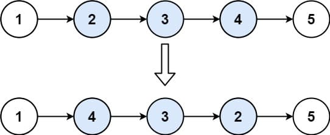
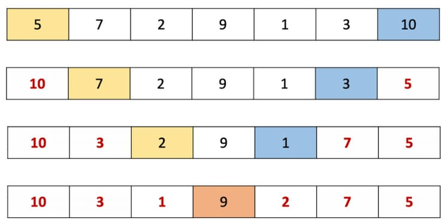

# 92. Reverse Linked List II

Given the <code>head</code> of a singly linked list and two integers <code>left</code> and <code>right</code> where <code>left &lt;= right</code>, reverse the nodes of the list from position <code>left</code> to position <code>right</code>, and return <em>the reversed list</em>.

&nbsp;

<strong class="example">Example 1:</strong>

<pre><strong>Input:</strong> head = [1,2,3,4,5], left = 2, right = 4
<strong>Output:</strong> [1,4,3,2,5]
</pre>

<strong class="example">Example 2:</strong>

<pre><strong>Input:</strong> head = [5], left = 1, right = 1
<strong>Output:</strong> [5]
</pre>

&nbsp;

<strong>Constraints:</strong>

<ul>
	<li>The number of nodes in the list is <code>n</code>.</li>
	<li><code>1 &lt;= n &lt;= 500</code></li>
	<li><code>-500 &lt;= Node.val &lt;= 500</code></li>
	<li><code>1 &lt;= left &lt;= right &lt;= n</code></li>
</ul>

&nbsp;

<strong>Follow up:</strong> Could you do it in one pass?

---

# Solution

- [Recursive Approach](#recursive-approach)

## **Problem Overview: Reverse Linked List II**

### Description
Given the `head` of a singly linked list and two integers `left` and `right` such that `1 <= left <= right <= n`, reverse the nodes of the list from position `left` to `right`, and return the modified list. This operation must be performed **in-place**, without creating new nodes for the reversed portion.

### Examples

#### Example 1:
**Input:**  
`head = [1,2,3,4,5]`, `left = 2`, `right = 4`  
**Output:**  
`[1,4,3,2,5]`  
**Explanation:**  
Only the sublist `[2,3,4]` is reversed to `[4,3,2]`.

#### Example 2:
**Input:**  
`head = [5]`, `left = 1`, `right = 1`  
**Output:**  
`[5]`  
**Explanation:**  
There is only one node; the list remains unchanged.

### Constraints
- The number of nodes in the list is `n`.
- `1 <= n <= 500`
- `-500 <= Node.val <= 500`
- `1 <= left <= right <= n`

### Follow-up
Can you perform the reversal in a **single traversal** of the list?

---

# Recursive Approach

## **Intuition**

Reversing a section of a linked list using recursion builds on a concept similar to reversing an array: **two pointers move inward from opposite ends, swapping elements until they meet.** In an array, this is straightforward due to the ability to use indices. We start with pointers at the `left` and `right` indices and move them toward the center, swapping values as we go.

### Visual Analogy:

An array of 7 elements is reversed using two pointers: one starting at the front (yellow) and the other at the end (blue). The elements at these pointers are swapped as the pointers move toward each other until they meet in the middle.

### Translating to Linked Lists

In a linked list, we **lack index access and backward traversal**, which makes this approach trickier. However, recursion provides a clever workaround. The **call stack can simulate backward traversal**, allowing us to reverse values between two nodes as the recursion unwinds.

### **Recursive Strategy**

1. **Advance to the Left**: We use a helper function that recurses down to the `right`-th node.
2. **Track Left Pointer**: A reference pointer (`leftPtr`) is passed through recursive calls, initially pointing to the `left`-th node.
3. **Swap During Backtracking**:
   - Once the base case is reached (when `right` reaches the end of the target range), recursion begins to backtrack.
   - During backtracking, we **swap values** between the `leftPtr` and current node.
   - `leftPtr` is moved forward each time to meet the current node from the other side.

### **Why This Works**

- The forward movement of the `leftPtr` and the backward progression of the recursion meet in the middle—exactly like array pointers.
- By halting swaps when the two pointers meet or cross, we preserve the boundaries of the reversed section.
- **No auxiliary data structure is needed**, and the recursion stack elegantly handles tracking the second pointer.

### **Edge Cases Considered**

- If `left == right`: No changes are needed.
- If the list has only one node: The base case protects against unnecessary recursion.
- If the list is reversed entirely: The method works the same as with any subrange.

## **Algorithm**

1. **Initialize Left Pointer**:
 - Define a global or external `leftPtr` variable pointing to the head of the list.
 - This pointer will advance forward as recursion backtracks.

2. **Define Recursive Function**:  
 - Create a recursive function `recurseAndReverse(rightNode, stopFlag)`:
   - If `right == 1`, return the current node (`rightNode`).
   - Recurse on `rightNode.next`, decrementing `right` by 1.

3. **Swap Values During Backtracking**:
 - When the recursive call stack unwinds:
   - If `leftPtr == rightNode` or `leftPtr.next == rightNode`, set the `stopFlag` to true.
   - Otherwise, swap `leftPtr.val` and `rightNode.val`.
   - Move `leftPtr` one step forward.

4. **Driver Function**:
 - Accept `head`, `left`, and `right` as arguments.
 - Advance `leftPtr` from `head` to the `left`-th node.
 - Call the recursive function with `head` and an initially `false` stop flag.
 - Return the updated head.

### Note:
- The recursion moves forward to locate the `right`-th node.
- Backtracking swaps values with the `leftPtr`, which is moved forward after each swap.
- Reversal halts when the pointers meet or cross.
