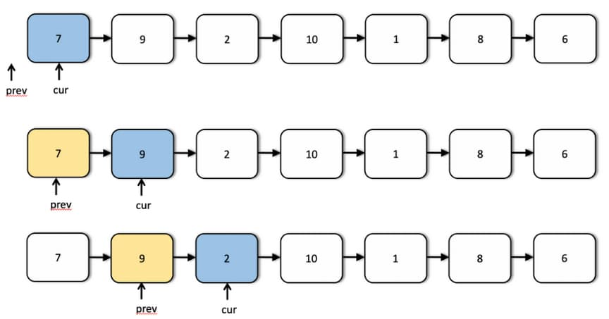

# 92. Reverse Linked List II

<p>Given the <code>head</code> of a singly linked list and two integers <code>left</code> and <code>right</code> where <code>left &lt;= right</code>, reverse the nodes of the list from position <code>left</code> to position <code>right</code>, and return <em>the reversed list</em>.</p>

<p>&nbsp;</p>
<p><strong class="example">Example 1:</strong></p>

<pre><strong>Input:</strong> head = [1,2,3,4,5], left = 2, right = 4
<strong>Output:</strong> [1,4,3,2,5]
</pre>

<p><strong class="example">Example 2:</strong></p>

<pre><strong>Input:</strong> head = [5], left = 1, right = 1
<strong>Output:</strong> [5]
</pre>

<p>&nbsp;</p>
<p><strong>Constraints:</strong></p>

<ul>
	<li>The number of nodes in the list is <code>n</code>.</li>
	<li><code>1 &lt;= n &lt;= 500</code></li>
	<li><code>-500 &lt;= Node.val &lt;= 500</code></li>
	<li><code>1 &lt;= left &lt;= right &lt;= n</code></li>
</ul>

<p>&nbsp;</p>
<strong>Follow up:</strong> Could you do it in one pass?

---

# Solution

- [Recursive Approach](#recursive-approach)
  - **Time Complexity**: `O(n)`
  - **Space Complexity**: `O(n)`
- [Iterative Approach](#iterative-approach)

## **Problem Overview: Reverse Linked List II**

### Description
Given the `head` of a singly linked list and two integers `left` and `right` such that `1 <= left <= right <= n`, reverse the nodes of the list from position `left` to `right`, and return the modified list. This operation must be performed **in-place**, without creating new nodes for the reversed portion.

### Examples

#### Example 1:
**Input:**  
`head = [1,2,3,4,5]`, `left = 2`, `right = 4`  
**Output:**  
`[1,4,3,2,5]`  
**Explanation:**  
Only the sublist `[2,3,4]` is reversed to `[4,3,2]`.

#### Example 2:
**Input:**  
`head = [5]`, `left = 1`, `right = 1`  
**Output:**  
`[5]`  
**Explanation:**  
There is only one node; the list remains unchanged.

### Constraints
- The number of nodes in the list is `n`.
- `1 <= n <= 500`
- `-500 <= Node.val <= 500`
- `1 <= left <= right <= n`

### Follow-up
Can you perform the reversal in a **single traversal** of the list?

---

# Recursive Approach

## **Intuition**

Reversing a section of a linked list using recursion builds on a concept similar to reversing an array: **two pointers move inward from opposite ends, swapping elements until they meet.** In an array, this is straightforward due to the ability to use indices. We start with pointers at the `left` and `right` indices and move them toward the center, swapping values as we go.

### Visual Analogy:


An array of 7 elements is reversed using two pointers: one starting at the front (yellow) and the other at the end (blue). The elements at these pointers are swapped as the pointers move toward each other until they meet in the middle.

### Translating to Linked Lists

In a linked list, we **lack index access and backward traversal**, which makes this approach trickier. However, recursion provides a clever workaround. The **call stack can simulate backward traversal**, allowing us to reverse values between two nodes as the recursion unwinds.

### **Recursive Strategy**

1. **Advance to the Left**: We use a helper function that recurses down to the `right`-th node.
2. **Track Left Pointer**: A reference pointer (`leftPtr`) is passed through recursive calls, initially pointing to the `left`-th node.
3. **Swap During Backtracking**:
   - Once the base case is reached (when `right` reaches the end of the target range), recursion begins to backtrack.
   - During backtracking, we **swap values** between the `leftPtr` and current node.
   - `leftPtr` is moved forward each time to meet the current node from the other side.

### **Why This Works**

- The forward movement of the `leftPtr` and the backward progression of the recursion meet in the middle—exactly like array pointers.
- By halting swaps when the two pointers meet or cross, we preserve the boundaries of the reversed section.
- **No auxiliary data structure is needed**, and the recursion stack elegantly handles tracking the second pointer.

### **Edge Cases Considered**

- If `left == right`: No changes are needed.
- If the list has only one node: The base case protects against unnecessary recursion.
- If the list is reversed entirely: The method works the same as with any subrange.

## **Visual Intuition Example**

### Step 0. The input list, output list, and arguments

Given the following list:

```text
7 -> 9 -> 2 -> 10 -> 1 -> 8 -> 6
```

and the following arguments:

- `head` = 7
- `left` = 3
- `right` = 6.

The final list is: 

```text
7 -> 9 -> 8 -> 1 -> 10 -> 2 -> 6
```

---

The sublist starts at position **3** and ends at position **6**:

```text
7 -> 9 -> 2 -> 10 -> 1 -> 8 -> 6
           ↑         ↑
         left      right
```

We're reversing the sublist `[2, 10, 1, 8]` into `[8, 1, 10, 2]`. Therefore, the transformed list is:

```text
7 -> 9 -> 8 -> 1 -> 10 -> 2 -> 6
```

### Step 1: Initiate Recursion and Advance Pointers


At the beginning of the recursion, both the `left` and `right` pointers are positioned at the head of the linked list. Since we aim to reverse a sublist from position `left` to `right`, the first recursive call sets this process in motion.

In this step:
- The recursion is invoked with updated indices: both `m` and `n` are decremented by 1.
- As part of this descent, each pointer advances one node forward in the list using `node = node.next`.

This movement continues until the base case is reached, where the `right` pointer lands on the final node of the segment to reverse.

### Step 2 & 3: Left Pointer Anchors, Right Pointer Continues


As recursion progresses, both pointers keep advancing one node per step. By the end of this step:
- The `left` pointer reaches its target node (position `left`) and is **anchored there** for the remainder of the recursive descent.
- The `right` pointer continues advancing with each recursive call until it lands on the final node in the reversal range (position `right`).

From this point forward, only the `right` pointer moves, setting up the eventual backtracking phase where the reversal will occur.

### Step 4 & 5: Base Case Reached and Backtracking Begins


At this point, both pointers have arrived at the boundaries of the sublist we want to reverse:
- The `left` pointer is anchored at the `left`-th node.
- The `right` pointer has reached the `right`-th node via recursive descent.

With the base case reached, we **stop further recursion** and initiate the backtracking phase.

During backtracking:
- **Swap the values** of the `left` and `right` nodes.
- Advance the `left` pointer by one node (`left = left.next`).
- The `right` pointer naturally moves backward as the recursion unwinds.

From this moment on, each step of backtracking performs a single swap, reversing the sublist pair by pair from the outside in.

### Step 6: Terminate Backtracking and Stop Swapping


At this stage of the backtracking process, the `right` pointer crosses over the `left` pointer. This marks the **logical midpoint** of the sublist we aimed to reverse. At this point:
- All necessary swaps have already been completed.
- The current state of the list matches the intended output:  
  `7 → 9 → 8 → 1 → 10 → 2 → 6`

Since we can't explicitly break out of recursion in most languages, we rely on a **global boolean flag** (`stop`) to prevent any further swaps once the pointers meet or cross.

This safeguard ensures the algorithm halts reversal precisely at the sublist's midpoint—maintaining correctness while allowing recursion to unwind naturally.

## **Algorithm**

This recursive algorithm reverses a sublist of a singly linked list from position `left` to `right`. The recursion simulates a two-pointer reversal strategy without the use of backward pointers or indices.

### **Step-by-Step**

1. **Initialize State**:
- Define two global/external variables:
  - `leftPtr`: Points to the `left`-th node (moves forward during backtracking).
  - `stopFlag`: A boolean to halt swaps once pointers meet or cross.

2. **Advance to the Left Node**:
- In the driver function (e.g., `reverseBetween`), traverse the list to position `left` and assign it to `leftPtr`.

3. **Define the Recursive Function**:
- Create a helper function (e.g., `recurse(m, n, rightNode)`) that takes:
  - `m`: current left index,
  - `n`: current right index,
  - `rightNode`: pointer starting from head and moving rightward.
- This function:
  - Recursively descends until `n == 1`, progressing `rightNode` forward and decrementing `n`.
  - Meanwhile, `leftPtr` is advanced until `m == 1`.

4. **Swapping During Backtracking**:
- After reaching the base case (`n == 1`), begin backtracking:
  - Swap values between `leftPtr` and `rightNode`.
  - Advance `leftPtr` using `leftPtr = leftPtr.next`.
- On each recursive unwind:
  - Continue swapping unless:
    - `rightNode == leftPtr` (odd-sized sublist, pointers meet).
    - `rightNode.next == leftPtr` (even-sized sublist, pointers cross).
  - When either condition is met, set `stopFlag = true` to halt further swaps.

5. **Driver Function**:
  - Accepts `head`, `left`, and `right`.
  - Advances a traversal pointer to the `left`-th node and assigns it to `leftPtr`.
  - Calls the recursive helper with `(right - left + 1)` as the depth.
  - Returns the modified `head`.

### **Key Mechanics**
- **Pointer Simulation**: Forward traversal is done by `leftPtr`, while backward movement is simulated by recursion backtracking.
- **Value Swapping**: Only node values are swapped—no structural changes.
- **Stop Conditions**: Ensure termination to prevent over-swapping and maintain list integrity.

### **Pseudocode**

```plaintext
# Global state
leftPointer = null
stopSwapping = false

function reverseBetween(head, left, right):
  global leftPointer, stopSwapping
  leftPointer = head
  stopSwapping = false

  recurseAndReverse(head, left, right)
  return head

function recurseAndReverse(rightNode, m, n):
  if n == 1 or rightNode is null:
    return

  # Walk right pointer one step forward
  rightNode = rightNode.next

  # Move left pointer to correct starting node
  if m > 1:
    leftPointer = leftPointer.next

  # Recurse with decreased bounds
  recurseAndReverse(rightNode, m - 1, n - 1)

  # Stop condition: pointers have met or crossed
  if leftPointer == rightNode or leftPointer.next == rightNode:
    stopSwapping = true

  # Swap node values if not stopped
  if not stopSwapping and rightNode is not null:
    temp = leftPointer.val
    leftPointer.val = rightNode.val
    rightNode.val = temp

    # Move leftPointer forward
    leftPointer = leftPointer.next
```

## **Implementation**

### Implementation Details

#### Advance right pointer before recursion

- Each recursive call shrinks the reversal window by decrementing `m` and `n`
- At the deepest level, `right` will land at the right boundary precisely at the **right-th node**, the stopping condition for backtracking

### Java

```java
class Solution2 {
  // Global pointers for recursion are object level variables
  // Need changes to persist across recursive calls since Java is Pass By Value
  private ListNode leftPointer;
  private boolean stop;

  public ListNode reverseBetween(ListNode head, int left, int right) {
    leftPointer = head;
    stop = false;

    // Start recursive backtracking from head
    recurseAndReverse(head, left, right);

    return head;
  }

  private void recurseAndReverse(ListNode right, int m, int n) {
    // Base case: stop at right-th node or end of list
    if (n == 1 || right == null) {
      return;
    }

    // Walk right pointer one step forward until it reaches (n == 1) (right boundary)
    right = right.next;

    // Keep moving left pointer to the right until we reach the proper node to start reversal
    if (m > 1) {
      this.leftPointer = this.leftPointer.next;
    }

    // Recursive call with m and n reduced
    this.recurseAndReverse(right, m - 1, n - 1);

    // Stop condition: pointers have met or crossed
    if (leftPointer == right || (right != null && leftPointer.next == right)) {
      stop = true;
    }

    // Swap values unless pointers have crossed
    if (!stop && right != null) {
      int temp = leftPointer.val;
      leftPointer.val = right.val;
      right.val = temp;

      // Advance leftPointer forward
      leftPointer = leftPointer.next;
    }

  }
}
```

### TypeScript

```typescript
class ListNode {
  val: number;
  next: ListNode | null;
  constructor(val?: number, next?: ListNode | null) {
    this.val = val === undefined ? 0 : val;
    this.next = next === undefined ? null : next;
  }
}

function reverseBetween(
  head: ListNode | null,
  left: number,
  right: number
): ListNode | null {
  let leftPointer = head;
  let stop = false;

  function recurseAndReverse(
    rightNode: ListNode | null,
    m: number,
    n: number
  ): void {
    // Base case: stop at right-th node or end of list
    if (n === 1 || rightNode === null) return;

    // Walk right pointer one step forward until it reaches (n == 1) (right boundary)
    rightNode = rightNode.next;

    // Keep moving left pointer to the right until we reach the proper node to start reversal
    if (m > 1) {
      leftPointer = leftPointer!.next;
    }

    // Recursive call with m and n reduced
    recurseAndReverse(rightNode, m - 1, n - 1);

    // Stop condition: pointers have met or crossed
    if (
      leftPointer === rightNode ||
      (rightNode !== null && leftPointer?.next === rightNode)
    ) {
      stop = true;
    }

    // Swap values unless pointers have crossed
    if (!stop && rightNode !== null) {
      const temp = leftPointer!.val;
      leftPointer!.val = rightNode.val;
      rightNode.val = temp;

      // Advance leftPointer forward
      leftPointer = leftPointer!.next;
    }
  }

  // Start recursive backtracking from head
  recurseAndReverse(head, left, right);

  // Return the modified list in-place
  return head;
}
```

## **Complexity Analysis**

### **Assumptions**
- `n` denotes the total number of nodes in the linked list.
- Only the sublist from position `left` to `right` is affected.
- Node values are swapped in-place—no new nodes or structural changes are made.

### **Time Complexity**: `O(n)`
- **Full Traversal for Setup**: In the worst case, we traverse up to the `left`-th node to position the `leftPtr`, which takes `O(left)` time.
- **Recursive Descent and Backtracking**: The recursion travels `right - left + 1` steps deep, which is at most `O(n)` in a full reverse.
- **Swap Operations**: At most `(right - left + 1) / 2` swaps occur, which is still `O(n)`.
- **Combined**: all operations are bounded by a single linear pass through the list, so the total complexity is **`O(n)`**.

### **Space Complexity**: `O(n)`
- **Call Stack Overhead**: The recursion depth is proportional to the sublist length, up to `O(n)` in the worst case.
- **Fixed Variable Usage**: A few pointers (`leftPtr`, `rightPtr`, flag) are used outside the recursion and consume constant space.
- **No Extra Data Structures**: The list is modified in-place; no array or auxiliary container is used.
- **Linear-Space Usage**: While variable usage is constant, the **recursive call stack grows linearly** with the size of the sublist being reversed.

# Iterative Approach

### Why Iterative?

- **Link manipulation is explicit**, so it's easier to reason about pointer changes.
- **Constant space**: Unlike recursion, there's no stack growth, making it more efficient for long lists.
- **Easier to generalize**: Iterative techniques are often preferred when handling complex linked list operations like merging, cycle detection, or K-group reversals.

Once the anchors are correctly set, the reversal inside the sublist is just a classic in-place reverse operation on a chain.

## **Intuition**

In contrast to the recursive technique—where we reversed a sublist by swapping **values**—this approach tackles the problem by rearranging **actual node links**, leaving the node values untouched.

There are many situations where mutating values isn't permitted:
- The nodes hold immutable or encapsulated data.
- The structure is shared in a context where value-level changes break consistency.

In such cases, **reversing the links between nodes** becomes the only viable strategy.

### Detailed Approach

We want to reverse the portion from position `left` to `right`. The goal is to:
- Keep the portion before `left` and after `right` untouched.
- Reverse all the `next` pointers within the sublist.
- Stitch the reversed segment back into the main list.

This requires:
1. Identifying and saving three anchor points:
   - The node before the reversal segment (`prev`)
   - The first node within the segment (`start`)
   - The node after the reversal segment (`tail`)

2. Iteratively reversing the links between the `left` and `right` nodes.

3. Reconnecting the reversed sublist to its surroundings.

### Understanding How Link Reversal Works

Before diving into the full algorithm, it's helpful to first understand how **reversing links in a singly linked list** works at a low level—and why we need multiple pointers to do it safely and effectively.

Let's say we have a segment of a linked list made up of three nodes:

```sh
A → B → C
```

We want to reverse the links so it becomes:

```sh
C → B → A
```

Now, consider that you're currently on node `B`, and you'd like to reverse the direction of its link so that it points to node `A`. If you have two pointers:

- `prev` → node A  
- `cur` → node B  

You can reverse the link between `B` and `A` with a simple operation:

```ts
cur.next = prev
```

This effectively changes the link so that:

```sh
A ← B   C
```

However, there's a **crucial problem**—once you update `cur.next`, you've lost your access to the rest of the list (`C`), because `cur.next` no longer points to it. To avoid breaking the chain, you need a **third pointer** to preserve that connection.

Here's the correct sequence of operations:

```ts
third = cur.next     // Save the next node (C)

cur.next = prev      // Reverse the link: B → A

prev = cur           // Move prev forward to B

cur = third          // Move cur forward to C
```

After executing this once, the list looks like:

```sh
prev = B
cur  = C
```

And you're ready to repeat the process for the next pair. By iterating this sequence over the desired sublist, you can reverse all the links one-by-one, maintaining control at each step without losing track of what's ahead.

In short:
- **Three pointers are essential**—one to track the previous node, one for the current, and one to preserve the connection forward.
- The reversal is done in-place, node by node, without creating new nodes or modifying their values.

This pattern forms the core of the iterative reversal algorithm you'll build next.

## **Visual Intuition Example**

### Visual Intuition: Iterative Reversal in Action

Before we implement the algorithm, it's important to visualize the pointer choreography involved in reversing a linked list segment iteratively.

This pointer process ensures that:
- Only the segment between `left` and `right` is reversed
- All other parts of the list remain connected and intact

*Note*: The variable name `con` in the diagrams is equivalent to variable `beforeLeft`.

### **Step 0. The input list, output list, and arguments**

Given the following list:

```text
7 -> 9 -> 2 -> 10 -> 1 -> 8 -> 6
```

And the following arguments:

- `head` = 7
- `left` = 3
- `right` = 6.

### **Step 1: Initialization and Preprocessing**



In the initial phase, we position our pointers to set up the reversal:
- `prev` is initialized to `null`
- `cur` starts at the head of the list

By advancing these pointers step by step, we prepare to isolate the sublist that needs to be reversed. Once `cur` reaches the `left`-th node, we're ready to start the reversal process. At this point, we also set up two anchor pointers:
- `beforeLeft` points to the node immediately before the reversal
- `tail` points to the first node of the reversal range (i.e. the `left`-th node)

### **Step 2: Link Reversal Loop**


With `prev`, `cur`, and a temporary pointer (`next`) in place, we begin reversing the links inside the sublist:
- Reverse `cur.next` to point to `prev`
- Move `prev` and `cur` forward
- Repeat for each node from `left` to `right`

This operation is repeated until we've processed all nodes in the reversal range.

### **Step 3: Completion of Reversal Segment**


After several iterations:
- `prev` now points to the `right`-th node (the new head of the reversed sublist)
- `cur` points to the node just after the sublist (`right + 1`)

At this stage, the reversal is complete, but the segment is still disconnected from the rest of the list.

### **Step 4: Reconnecting the Segments**


To finalize the transformation, we reattach the reversed sublist:
- `beforeLeft.next = prev` connects the node before the reversal to the new head
- `tail.next = cur` reconnects the new tail to the remainder of the list

This restores the structural integrity of the entire linked list with the desired segment fully reversed.

## **Algorithm**

### Step-by-Step Setup and Link Reversal Process

1. **Initialize Two Traversal Pointers**  
   To begin, we use two pointers:
   - `prev` initialized to `null`
   - `cur` initialized to the `head` of the list

