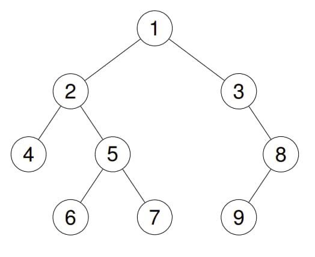

# 94. Binary Tree Inorder Traversal

<p>Given the <code>root</code> of a binary tree, return <em>the inorder traversal of its nodes' values</em>.</p>

<p>&nbsp;</p>
<p><strong class="example">Example 1:</strong></p>

<div class="example-block">
<p><strong>Input:</strong> <span class="example-io">root = [1,null,2,3]</span></p>

<p><strong>Output:</strong> <span class="example-io">[1,3,2]</span></p>

<p><strong>Explanation:</strong></p>

<p></p>
</div>

<p><strong class="example">Example 2:</strong></p>

<div class="example-block">
<p><strong>Input:</strong> <span class="example-io">root = [1,2,3,4,5,null,8,null,null,6,7,9]</span></p>

<p><strong>Output:</strong> <span class="example-io">[4,2,6,5,7,1,3,9,8]</span></p>

<p><strong>Explanation:</strong></p>

<p></p>
</div>

<p><strong class="example">Example 3:</strong></p>

<div class="example-block">
<p><strong>Input:</strong> <span class="example-io">root = []</span></p>

<p><strong>Output:</strong> <span class="example-io">[]</span></p>
</div>

<p><strong class="example">Example 4:</strong></p>

<div class="example-block">
<p><strong>Input:</strong> <span class="example-io">root = [1]</span></p>

<p><strong>Output:</strong> <span class="example-io">[1]</span></p>
</div>

<p>&nbsp;</p>
<p><strong>Constraints:</strong></p>

<ul>
	<li>The number of nodes in the tree is in the range <code>[0, 100]</code>.</li>
	<li><code>-100 &lt;= Node.val &lt;= 100</code></li>
</ul>

<p>&nbsp;</p>
<strong>Follow up:</strong> Recursive solution is trivial, could you do it iteratively?

<br>

---

# Solution

- [Recursive Approach](#recursive-approach)

## Binary Tree Overview

**Key Points**:

- **Root Node**: The topmost node of the tree.
- **Child Nodes**: Each node can have up to two children, referred to as the left and right child.
- **Leaf Nodes**: Nodes with no children.
- **Depth/Height**: The length of the path from the root to the deepest leaf node.
- **Binary Search Tree (BST)**: A special type of binary tree where the left child's value is less than the parent's value, and the right child's value is greater than the parent's value.
- **Traversal Methods**: Methods to visit nodes in a binary tree, including In-order, Pre-order, and Post-order.

### Binary Tree in Array Form

A binary tree can be represented using an array, where the array elements correspond to the nodes of the tree. This representation is particularly useful for complete binary trees.

Representing a binary tree in array form is a simple and efficient method for complete binary trees. It leverages the properties of array indexing to quickly access parent and child nodes, making it suitable for certain applications where the tree structure is predictable and does not change dynamically.

#### Key Points:

1. **Root Node**:
   - The root node of the binary tree is stored at index 0 of the array.

2. **Left Child**:
   - For a node at index `i`, its left child is located at index `2i + 1`.

3. **Right Child**:
   - For a node at index `i`, its right child is located at index `2i + 2`.

4. **Parent Node**:
   - For a node at index `i`, its parent is located at index `(i - 1) / 2`.

#### Example:

Consider the following binary tree:

```code
      1
    /   \
   2     3
  / \   / \
 4   5 6   7
```

This binary tree can be represented in an array as:

```code
[1, 2, 3, 4, 5, 6, 7]
```

#### Detailed Explanation:

1. **Index 0**: The root node `1` is stored at index `0`.
2. **Indices 1 & 2**: The left child `2` and right child `3` of the root node are stored at indices `1` and `2` respectively.
3. **Indices 3 & 4**: The left child `4` and right child `5` of node `2` are stored at indices `3` and `4` respectively.
4. **Indices 5 & 6**: The left child `6` and right child `7` of node `3` are stored at indices `5` and `6` respectively.

#### Benefits:

- **Memory Efficiency**: For complete binary trees, this representation avoids the need for storing pointers to child nodes.
- **Ease of Access**: It allows for direct access to nodes using array indexing, which can simplify algorithms for traversal and manipulation.

#### Limitations:

- **Sparse Trees**: For binary trees that are not complete, this representation may lead to wasted space in the array.
- **Fixed Size**: The size of the array needs to be known in advance, which can be a limitation for dynamically growing trees.

# Recursive Approach

## **Intuition**

In an in-order traversal, we recursively visit the left subtree, then the root node, and finally the right subtree. The key idea is to recursively solve for the left subtree first, then handle the root node, and finally recursively solve for the right subtree.

## **Algorithm**

1. Initialize an empty list `answer` to store the in-order traversal.
2. Define a recursive helper function `inorder(node)` that:
   - If `node` is `null`, return.
   - Recursively call `inorder(node.left)` to traverse the left subtree.
   - Add the value of `node` to `answer`.
   - Recursively call `inorder(node.right)` to traverse the right subtree.
3. Call the helper function `inorder` starting from the `root` node.
4. Return the `answer` list containing the in-order traversal.

### Pseudocode

```plaintext
function inorderTraversal(root):
    answer = []

    function inorder(node):
        if node is null:
            return
        inorder(node.left)
        answer.append(node.val)
        inorder(node.right)

    inorder(root)
    return answer
```

## **Implementation**

#### Implementation Details

- **Initialization**: Initialize an empty `ArrayList` to store the in-order traversal result.

- **Recursive Helper Function**: The `inorder` function recursively traverses the left subtree, adds the current node's value to the `answer` list, and then traverses the right subtree.

- **Start Traversal**: The traversal starts with the root node by calling `inorder(root, answer)`.

- **Return Result**: Finally, the list containing the in-order traversal result is returned.

##### Binary Tree Definition

```java
/**
 * Definition for a binary tree node.
 */
public class TreeNode {
  int val;
  TreeNode left;
  TreeNode right;

  TreeNode() {
  }

  TreeNode(int val) {
    this.val = val;
  }

  TreeNode(int val, TreeNode left, TreeNode right) {
    this.val = val;
    this.left = left;
    this.right = right;
  }
}
```
